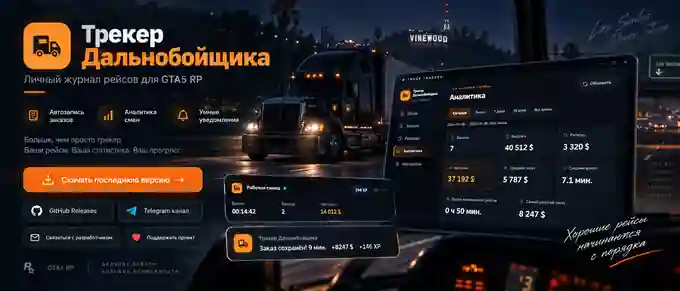
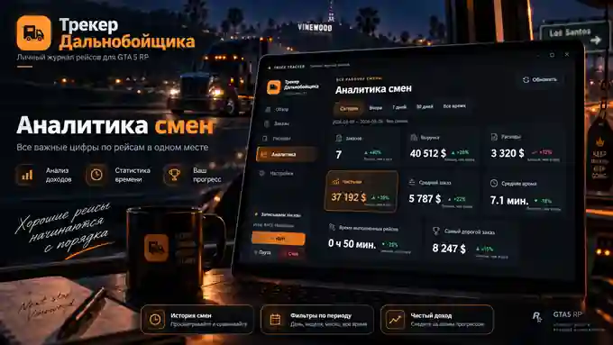

 

**Windows 10 / 11 · GTA5 RP · RAGE Multiplayer**

---

## 🚛 Что это

**Трекер Дальнобойщика** — персональный журнал рейсов для GTA5 RP. Он помогает не считать всё вручную: сохраняет завершённые заказы, доход, XP и расходы, ведёт историю рабочих смен и показывает реальную статистику работы.

Главная идея простая: **играешь как обычно — трекер сам собирает нужные цифры.**

### Основные возможности

- 📦 автоматическая запись завершённых заказов;
- 💵 учёт выручки, расходов и чистого дохода;
- ⭐ учёт полученного и потраченного XP;
- ⏱️ время рейсов, средний заказ и доход в час;
- 📊 аналитика за сегодня, вчера, 7 дней, 30 дней и всё время;
- 🖥️ компактное мини-окно поверх игры;
- 🔔 кастомные уведомления о сохранённых заказах;
- ⌨️ быстрые расходы через горячие клавиши;
- 🧾 история заказов и рабочих смен;
- 🔄 автоматическая проверка новых версий и обновление из приложения.

---

## 📊 Аналитика смен

После завершения игры статистика не исчезает. Можно посмотреть, сколько было выполнено рейсов, сколько заработано и потрачено, какой получился чистый доход и насколько эффективно прошла смена.

Трекер показывает **выручку, расходы, чистыми, средний заказ, среднее время, время выполненных рейсов и самый дорогой заказ**.

---

## 🔔 Уведомления и мини-окно

Во время игры основные цифры можно держать перед глазами. Мини-окно показывает состояние смены, время, количество заказов, чистый доход и XP, а после сохранения заказа появляется компактное уведомление поверх игры.

Звук уведомлений можно отключить, изменить его громкость и проверить прямо из настроек.

---

## 🆕 Что нового

### `v0.1.0-alpha.14`

- 🔄 добавлена **автоматическая проверка обновлений** при запуске;
- ⬇️ если новая версия доступна, её можно **скачать и запустить установку прямо из приложения**;
- ✅ перед установкой трекер проверяет SHA-256 релизного файла, если GitHub предоставляет контрольную сумму;
- 🌐 в настройках появился отдельный блок со страницей проекта и Releases;
- 📢 добавлен Telegram-канал разработчика;
- 💬 добавлен быстрый контакт с разработчиком;
- ❤️ добавлена добровольная поддержка проекта;
- ✨ блок обновлений и контактов оформлен в едином стиле приложения.

Полная история версий: **[CHANGELOG.md](CHANGELOG.md)**.

---

## ⬇️ Скачать

### [🚛 Скачать последнюю версию](https://github.com/shimoryw/truck-tracker/releases/latest)

В Release доступны два варианта:

**`TruckTracker-...-Setup.exe`** — рекомендуемый установщик для Windows.  
**`TruckTracker-...-Portable.exe`** — версия без установки.

[Все версии](https://github.com/shimoryw/truck-tracker/releases)

> Для обычного использования рекомендуется **Setup.exe**. После установки новые версии трекер сможет находить самостоятельно.

---

## ⌨️ Быстрые действия

Расходы и XP можно записывать, не переключаясь надолго из игры.

| Комбинация | Действие |
|---|---|
| `Ctrl + 1` | ⛽ Бензин |
| `Ctrl + 2` | 💰 Ограбили |
| `Ctrl + 3` | 🔧 Ремонт |
| `Ctrl + 4` | 💳 Штраф / взятка |
| `Ctrl + 5` | ⭐ Потратить XP |

---

## 🧭 Первый запуск

1. Скачайте последнюю версию в **Releases**.
2. Запустите Трекер Дальнобойщика.
3. Выберите окно RAGE Multiplayer.
4. Настройте области распознавания времени заказа и итоговой выплаты.
5. Выполните **«Проверку сейчас»** в настройках.
6. При необходимости укажите текущий XP персонажа.
7. Нажмите **«Начать»** и играйте как обычно.

> Перед первой полноценной сменой рекомендуется выполнить один тестовый заказ и убедиться, что время, выплата и XP записались правильно.

---

## 👨‍💻 Разработчик и новости

**Канал разработчика:** [t.me/shim0ryw](https://t.me/shim0ryw)  
**Контакт разработчика:** [@shimoryw](https://t.me/shimoryw)

В канале публикуются новости проекта, изменения новых версий и планы по развитию трекера.

---

## ❤️ Поддержать проект

Если трекер оказался полезен и хочется поддержать дальнейшую разработку — это можно сделать добровольно через Telegram-счёт.

Счёт можно оплатить **анонимно**, при желании добавить комментарий. Поддерживаются:

`USDT` · `TON` · `SOL` · `BTC` · `DOGE` · `LTC` · `ETH` · `BNB` · `TRX` · `USDC`

Поддержка никак не влияет на возможности приложения — трекер остаётся доступен обычным пользователям без обязательных платежей.

---

## ❓ FAQ

<b>Трекер сам записывает каждый завершённый заказ?</b>

 
Да. После первоначальной настройки областей распознавания приложение отслеживает экран завершённого заказа и сохраняет время, выплату и XP.

<b>Нужно ли каждый раз настраивать области заново?</b>

 
Нет. Настройки сохраняются. Повторная настройка обычно нужна только если изменилось разрешение, масштаб интерфейса игры или расположение окна.

<b>Где хранится моя статистика?</b>

 
История трекера хранится локально на компьютере пользователя. Сбросить статистику можно в настройках приложения.

<b>Обновления устанавливаются сами?</b>

 
Трекер автоматически проверяет наличие новой версии. Установка начинается только после нажатия пользователем кнопки обновления.

<b>Что делать, если заказ определился неправильно?</b>

 
Сначала выполните «Проверку сейчас» в настройках и при необходимости заново выделите области времени и выплаты. Ошибочную запись можно удалить из истории.

---

## 🐞 Нашли ошибку или есть идея?

Создайте обращение через **Issues**. Чем точнее описание, тем быстрее можно понять причину.

Желательно приложить скриншот, версию приложения и коротко написать, что происходило перед проблемой.

[Сообщить об ошибке](https://github.com/shimoryw/truck-tracker/issues/new/choose) · [Предложить улучшение](https://github.com/shimoryw/truck-tracker/issues/new/choose) · [Открыть Releases](https://github.com/shimoryw/truck-tracker/releases)

  

**Трекер Дальнобойщика**  
*Хорошие рейсы начинаются с порядка.*

